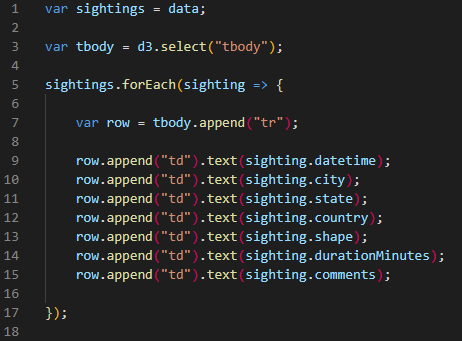
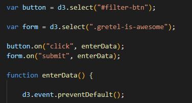
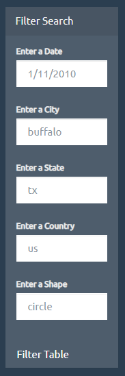
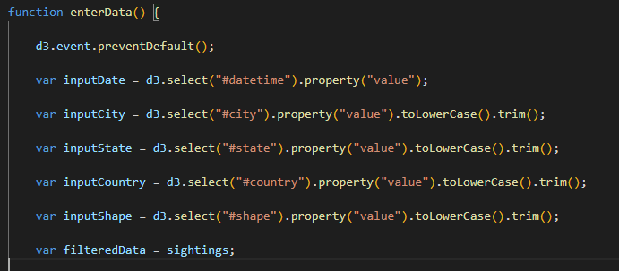
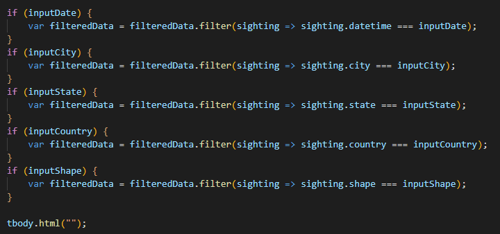
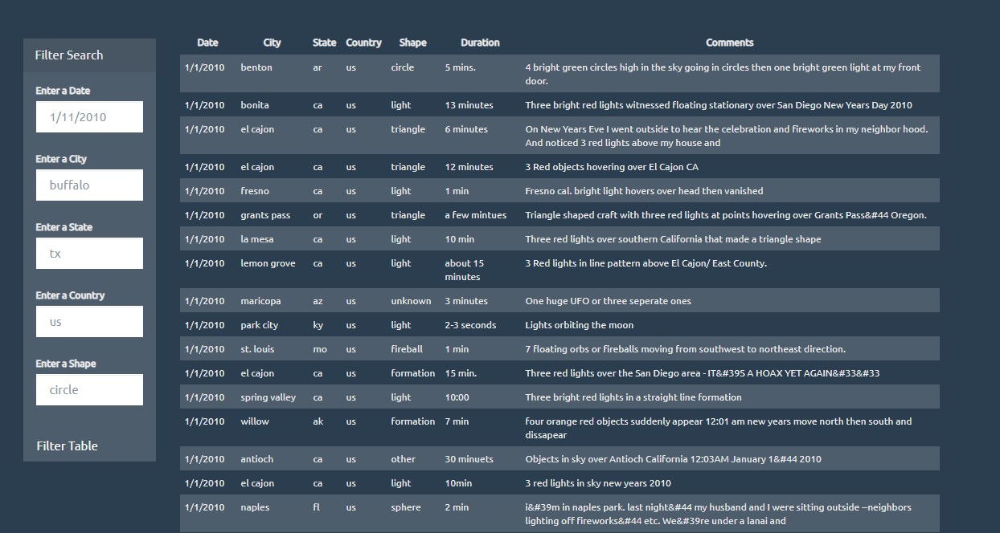
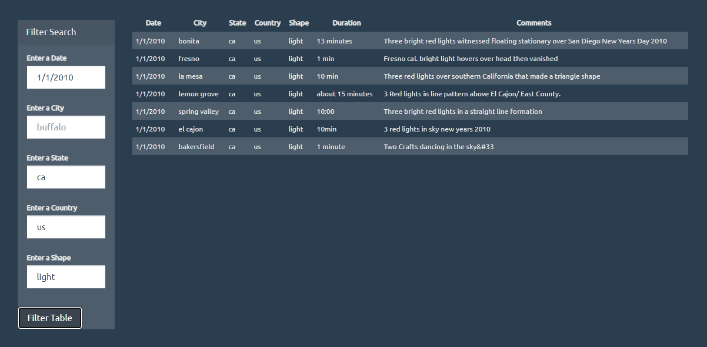

# UFO-JavaScript
*JavaScript and DOM Manipulation*

## Table of contents
* [General info](#general-info)
* [Technologies](#technologies)
* [Table Setup](#table-setup)
* [Filter Button](#filter-button)
* [Example](#example)
* [Conclusion](#conclusion)
* [Contact](#contact)

## General info

WAKE UP SHEEPLE! The extra-terrestrial menace has come to Earth and we here at `ALIENS-R-REAL` have collected all of the eye-witness reports we could to prove it! I have created a dynamic table based on the dataset that can be searched based on 5 key criteria related to the sightings:

* Date/Time of sighting
* City of sighting
* State of sighting
* Country of sighting
* Shape of ‘event’ 

## Technologies

* JavaScript
* HTLM
* CSS
* D3.js

## Table Setup
First, I reviewed the dataset which includes detailed accounts of alien sightings during the year 2010. The data is an array of objects. Each object represents a specific sighting and includes data pertaining to the time, location, shape of even, duration of event, and comments given by observer. 

I compiled this data into a table that populates on the UFO website when you arrive at the landing page. To create the table, I used a `forEach` statement to go through my sightings data and `.append` the table with the data in each cell. 

## Filter Button
I created an `event` that triggered a function when the “filter” button is selected. When you click the “filter” button, the table is filtered by the input data. 

I also used `d3.event/preventDefault() ` to prevent the page from reloading. 

To make the table search more dynamic, I have 5 input fields to search by:
* Date/Time of sighting
* City of sighting
* State of sighting
* Country of sighting
* Shape of ‘event’ 

If data is input in any combination of these fields, the table will filter on those criteria. Each input field allows capital or lower-case text to be entered and will auto correct to lower case to match the dataset values.

When the fields are empty and the “filter” button is selected, the table will rest to the full list of sightings. To create this, I used `if` statements as per below:

## Filter Example

When the website loads, the entire dataset is shown in a table. 

When user inputs criteria into the different input fields, the table is filtered to show only the data requested. 

When the fields are empty, and the filter button is selected the table will re-load to original full dataset table. 

## Conclusion 

As you can see from the numerous accounts in 2010, there *is* something out there… 

## Contact

[Sara Simoes](https://github.com/Ssimoes48)
